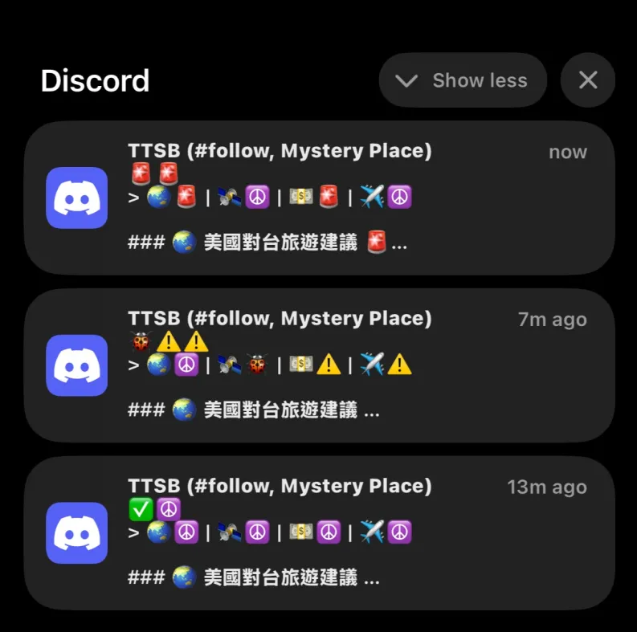
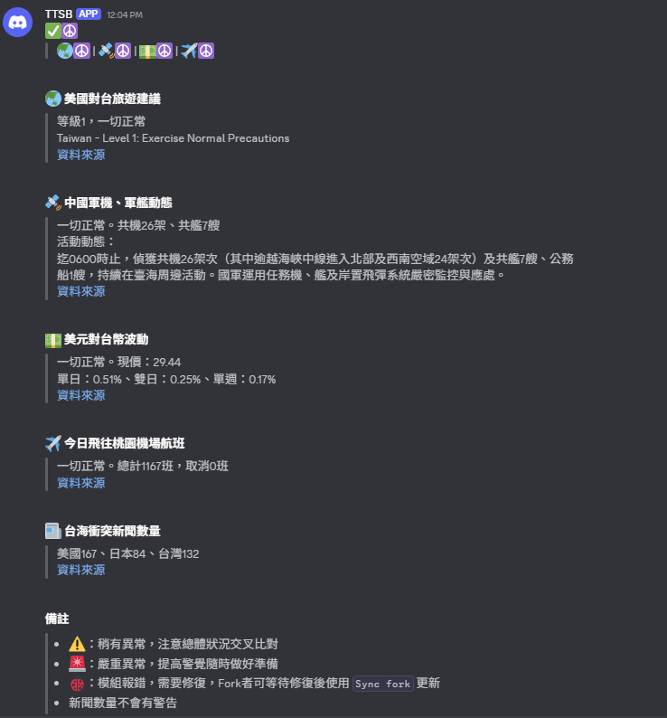
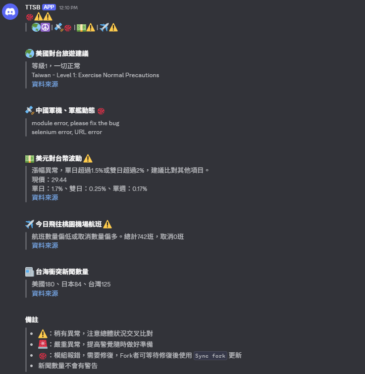
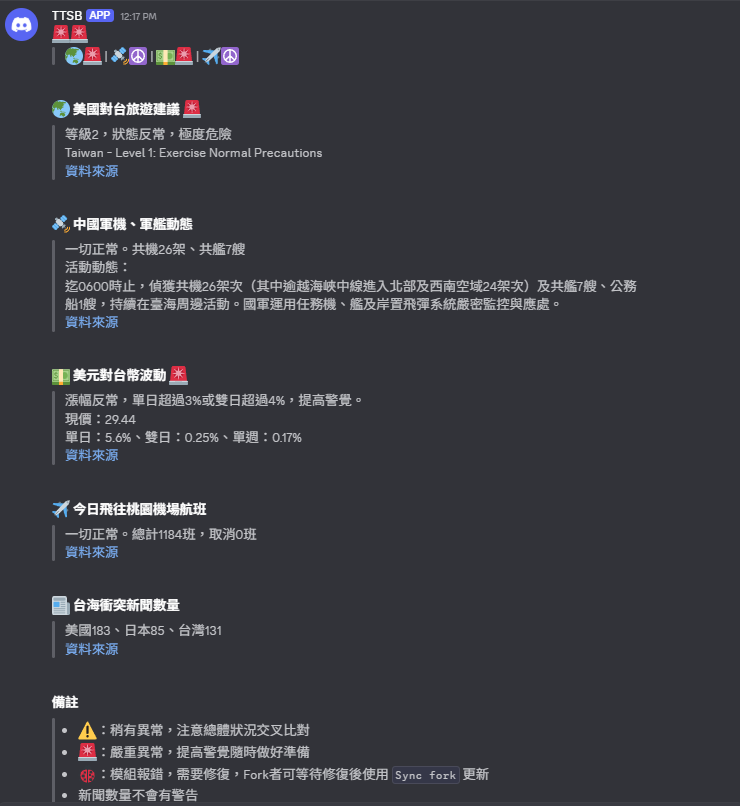

# 台海安全每日彙報機器人

## 摘要

> 使用 Discord 發送每日彙報

1. 總覽狀態 - 正常狀態 或 顯示警告/報數量
2. 模組狀態 - 列出每個模組的狀態
3. 五個模組 - 抓取資料並分析
   - 美國對台旅遊建議
   - 中國軍機、軍艦動態
   - 美元對台幣波動
   - 今日飛往桃園機場航班(需要申請 API)
   - 台海衝突新聞數量(沒有警報)

## 範例

> 手機通知預覽
>
> 

> 正常狀況訊息
>
> 

> 兩個模組發出警告，一個模組出錯
>
> 

> 兩個模組發出嚴重警報
>
> 

## 如何設置

[連結](README.zh.md)
